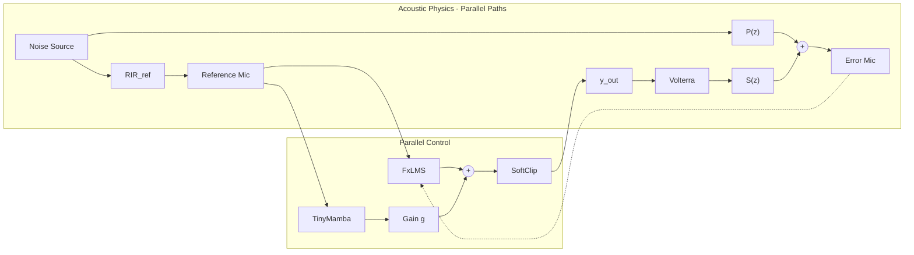

<!-- 9c53560f-faa1-4761-b282-1afd05aea751 b16d5266-0b5b-4ec6-b2b8-76d09589b628 -->
# Deep ANC Project Implementation

## Overview

A **Parallel Predictive Feedforward** Active Noise Cancellation system combining:

- **FxLMS**: Linear adaptive filter for broadband noise (20-800Hz)
- **TinyMamba**: Non-linear predictor for residuals FxLMS misses

**Critical Design Principle**: Parallel topology (NOT serial). Mamba outputs a "delta injection" summed with FxLMS, preserving the correlation needed for FxLMS convergence.

## Architecture



## File Structure

```
/home/jovyan/ANC/
├── requirements.txt          # torch, torchaudio, mamba-ssm, pyroomacoustics, scipy
├── data/raw/                 # Audio files (UrbanSound8K, FSD50K)
├── src/
│   ├── __init__.py
│   ├── utils.py              # soft_clip, watchdog, fractional_delay, C-weight curve
│   ├── physics.py            # P(z), S(z), RIR_ref, Volterra nonlinearity
│   ├── dataset.py            # ANCDataset with physics-based augmentation
│   ├── mamba_anc.py          # TinyMamba (skip-connections, leaky state)
│   ├── fxlms.py              # FxLMS adaptive filter
│   └── loss.py               # C-weighted + phase cosine + uncertainty penalty
├── train.py                  # Offline training with delay compensation
└── simulate.py               # Real-time simulation loop
```

## Module Specifications

### 1. `src/utils.py` - Core Utilities

| Function | Purpose |

|----------|---------|

| `soft_clip(x, 0.95)` | Tanh limiter preventing amplifier clipping |

| `watchdog_check(buffer)` | Monitor 2-5kHz for howling, trigger bypass |

| `fractional_delay(sig, n)` | Sinc interpolation for sub-sample delays |

| `modified_c_weight(freqs)` | Flat 20Hz-1kHz, -12dB/oct above (bass priority) |

| `db_to_linear(db)` | Decibel conversion helper |

### 2. `src/physics.py` - Acoustic Digital Twin

Three distinct paths (research lines 91-100):

- `RIR_ref`: Noise source → Reference mic
- `P_z`: Noise source → Ear (primary path)
- `S_z`: Speaker → Ear (secondary path, includes hardware delay)

Plus `speaker_nonlinearity()`: 3rd-order Volterra approximation for cone distortion.

### 3. `src/mamba_anc.py` - Neural Predictor

- **Encoder**: `Conv1d(1, 32, k=4, stride=2)` - phase-linear downsampling
- **Core**: 2x Mamba blocks (`d_model=32, d_state=16, expand=1`) with skip-connections
- **Decoder**: `ConvTranspose1d(32, 1, k=4, stride=2)`
- **State**: `apply_leaky_state(0.95)` prevents drift over hours

### 4. `src/fxlms.py` - Linear Adaptive Filter

Standard FxLMS with:

- 64 taps, µ=0.005 (tune until instability, back off 50%)
- `S_hat` estimate for filtered-x computation
- `update(x, e)` and `predict(x)` methods
- `reset_weights()` for emergency bypass

### 5. `src/loss.py` - Composite Loss Function

```
L_total = 1.0*L_time + 0.5*L_spec + 0.5*L_phase + 0.1*L_uncertainty
```

- **L_time**: MSE in time domain
- **L_spec**: C-weighted magnitude distance (prioritizes 20-800Hz)
- **L_phase**: `1 - cos(θ_pred - θ_target)` - explicit phase penalty
- **L_uncertainty**: Penalize high output when input is stochastic

### 6. `src/dataset.py` - Data Pipeline

- Load `.wav` files, resample to 48kHz mono
- Chunk to 16384 samples
- **Augmentation** (physics-based):
  - Gain: ±6dB (mic calibration variance)
  - Delay: ±5 samples via sinc interpolation (distance change)
  - Leakage: Convolve with "leaky fit" TF library (30% probability)

### 7. `train.py` - Offline Training

- **Delay compensation**: `K=3` samples (~60µs at 48kHz)
- **Target**: `-1.0 * noise[:, :, K:]` (inverted future)
- **Input**: `noise[:, :, :-K]`
- Optimizer: AdamW, lr=1e-3
- Epochs: 50, batch size: 16

### 8. `simulate.py` - Runtime Loop

Chunk-based (64 samples) for efficiency:

1. **FxLMS**: Predict on raw reference, update with previous error
2. **Mamba**: Process chunk, output residual prediction
3. **Sum**: `y = y_lin + g * y_deep` (g starts at 0, tune up)
4. **Safety**: `soft_clip(y, 0.95)`
5. **Physics**: Apply Volterra → S(z) → sum with P(z) noise
6. **Watchdog**: If 2-5kHz energy high for 50+ samples → bypass

## Evaluation Metrics

| Metric | Target | Formula |

|--------|--------|---------|

| Active Insertion Loss | >25dB @ 100Hz | Band-limited power ratio |

| Coherence (MSC) | ≈0 | `scipy.signal.coherence` |

| Boost Probability | <0.1% | `mean(abs(e) > abs(d))` |

| Impulse Artifact Rate | Low | Peak detection in `diff(error)` |

| Hiss Level | <25dBA | A-weighted RMS in silence |

| NMSE | <-15dB | `10*log10(E[e²]/E[d²])` |

## Research Compliance Summary

| Research Requirement | Implementation |

|---------------------|----------------|

| Parallel topology (not serial) | FxLMS + Mamba both on raw reference |

| Phase-linear input (no IIR) | Strided Conv1d encoder |

| C-weighted loss (not A-weighted) | Flat 20Hz-1kHz, rolloff above |

| Parallel path simulation | P(z) + S(z) summed, not serial |

| Speaker nonlinearity | Volterra 3rd-order polynomial |

| Separate ref mic path | RIR_ref ≠ P(z) |

| Leaky state reset | `apply_leaky_state(0.95)` |

| Phase cosine loss | Explicit `1 - cos(Δθ)` term |

| Uncertainty penalty | Conservative zero on stochastic |

| Watchdog safety | 2-5kHz energy monitor + bypass |

| Delay compensation | K=3 samples, target shifted ahead |

### To-dos

- [ ] Create project structure, requirements.txt, src/__init__.py
- [ ] Implement src/utils.py: soft_clip, watchdog, fractional_delay, weighting curves
- [ ] Implement src/physics.py with PARALLEL path simulation (P(z) + S(z))
- [ ] Implement src/dataset.py with physics-based augmentation (gain, delay, leakage)
- [ ] Implement src/mamba_anc.py with strided conv encoder + leaky state reset
- [ ] Implement src/fxlms.py with FxLMS adaptive filter
- [ ] Implement src/loss.py: C-weighted spectral + phase cosine + composite
- [ ] Implement train.py with delay-compensated targets and composite loss
- [ ] Implement simulate.py with PARALLEL topology and safety watchdog