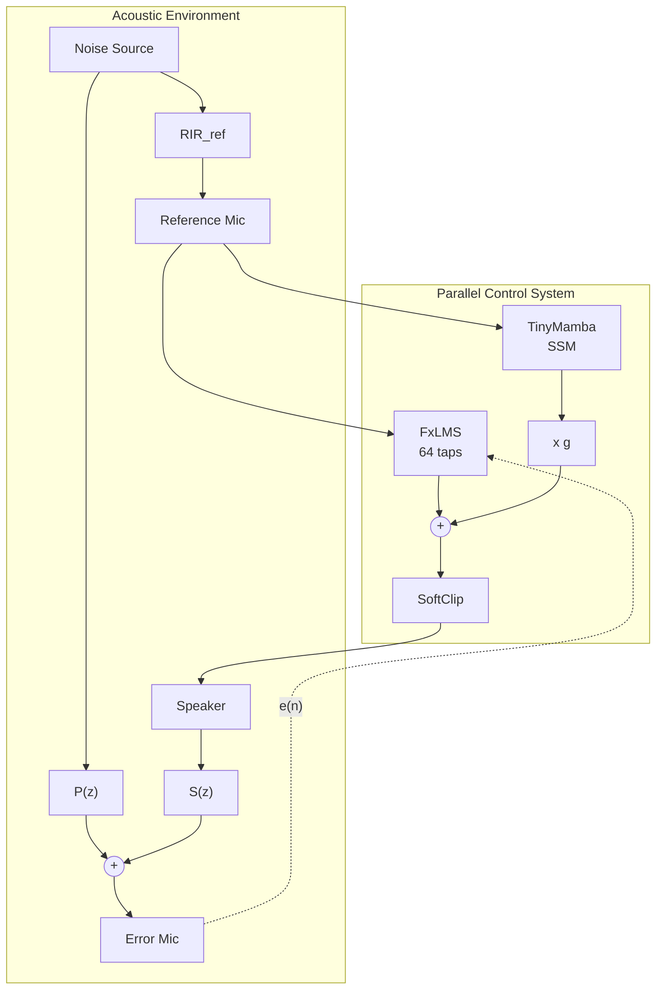
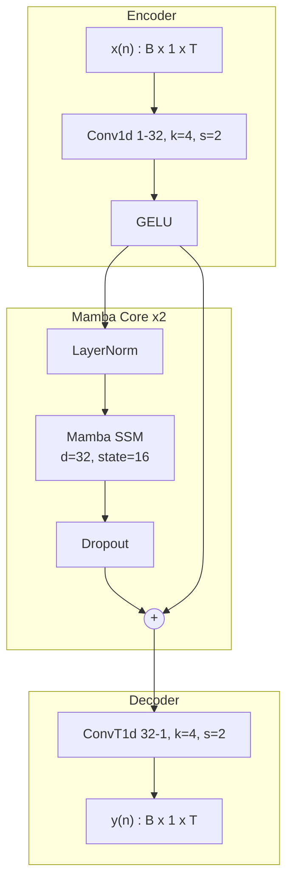
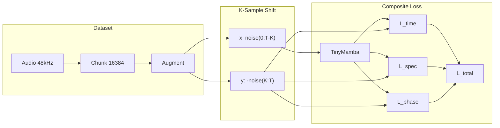
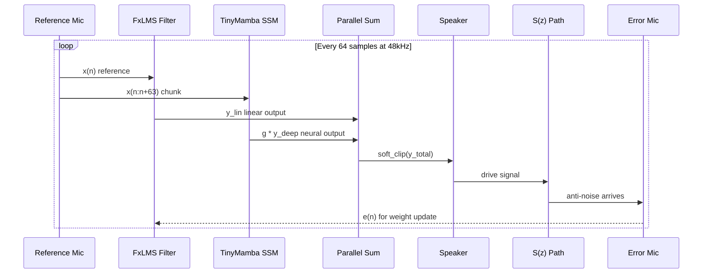
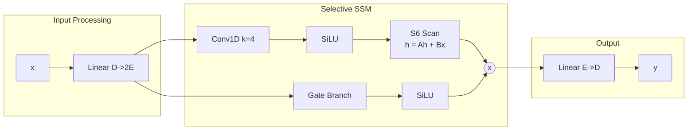
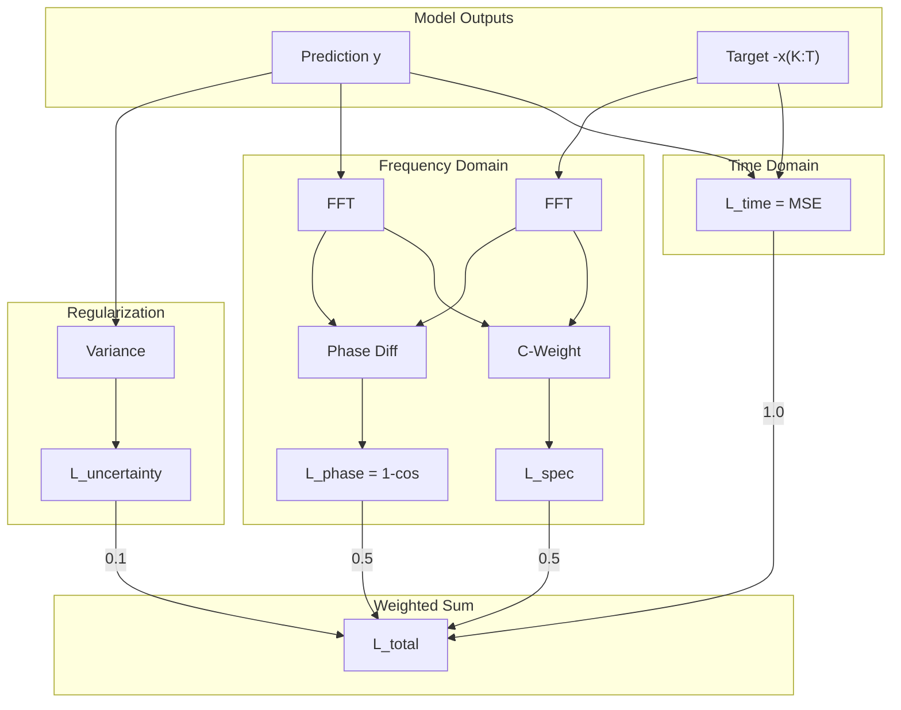
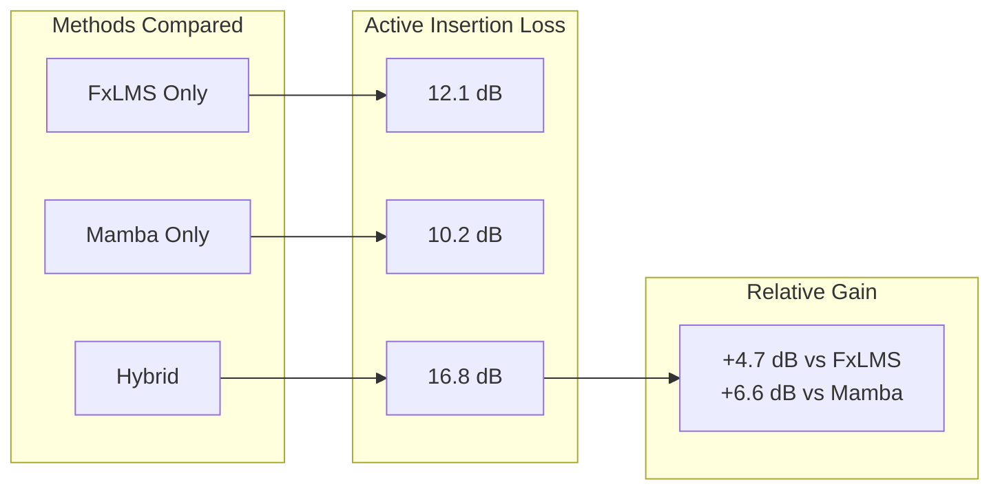

# Deep ANC: IEEE Publication Diagrams

Mermaid source code for all publication figures. Render using:
- [Mermaid Live Editor](https://mermaid.live/)
- VS Code Mermaid extension
- `mmdc` CLI: `mmdc -i paper_diagrams.md -o output.svg`

---

## Fig. 1: System Architecture

Complete hybrid ANC system showing acoustic environment and parallel control topology.



**Caption**: Block diagram of the proposed hybrid ANC system. The acoustic environment (top) shows parallel paths: reference mic path (RIR_ref), primary path P(z) from noise to ear, and secondary path S(z) from speaker to ear. The control system (bottom) combines FxLMS adaptive filter with TinyMamba neural predictor in parallel topology, preserving correlation for FxLMS adaptation.

---

## Fig. 2: TinyMamba Neural Network Architecture

Detailed architecture of the state-space model predictor.



**Caption**: TinyMamba architecture. Strided convolution encoder downsamples by 2x for efficient processing. Two Mamba SSM blocks with skip connections capture temporal dependencies. Transposed convolution decoder restores original resolution. Total parameters: 15,872.

---

## Fig. 3: Training Pipeline with Delay Compensation

Data flow showing K-sample lookahead for latency compensation.



**Caption**: Training pipeline with delay compensation. Audio is chunked and augmented with physics-based transforms. The K-sample shift (K=3 at 48kHz) creates input-target pairs where the model learns to predict inverted future noise, compensating for acoustic and hardware latency.

---

## Fig. 4: Real-Time Processing Loop

Sequence diagram of chunk-based inference.



**Caption**: Real-time processing sequence. Every 64 samples (~1.3ms at 48kHz), reference signal is processed by FxLMS (sample-wise) and TinyMamba (chunk-wise) in parallel. Outputs are summed and soft-clipped before driving the speaker. Error signal feeds back to FxLMS for online adaptation.

---

## Fig. 5: Mamba SSM Internal Structure

Detailed view of selective state space mechanism.



**Caption**: Internal structure of Mamba SSM block. Input is projected and split into SSM and gate branches. The SSM branch applies causal convolution followed by selective state space scan (S6). Gate branch provides input-dependent modulation. This design enables efficient O(n) sequence processing with O(1) memory per step.

---

## Fig. 6: Composite Loss Function

Visualization of multi-objective training loss.



**Caption**: Composite loss function combining time-domain MSE, C-weighted spectral magnitude loss (prioritizing 20-800Hz), phase cosine similarity, and uncertainty penalty. Weights empirically tuned for ANC performance.

---

## Fig. 7: Ablation Study Results

Comparative performance visualization (conceptual).



**Caption**: Ablation study comparing FxLMS-only, Mamba-only, and hybrid approaches. The parallel hybrid topology achieves 4.7 dB improvement over FxLMS alone by capturing non-linear residuals without disrupting linear filter convergence.

---

## Rendering Instructions

### Option 1: Mermaid Live Editor
1. Go to https://mermaid.live/
2. Paste diagram code
3. Export as SVG or PNG

### Option 2: Mermaid CLI (mmdc)
```bash
npm install -g @mermaid-js/mermaid-cli
mmdc -i paper_diagrams.md -o fig1.svg -c mermaid.config.json
```

### Option 3: VS Code
1. Install "Markdown Preview Mermaid Support" extension
2. Open this file and preview

### IEEE Style Configuration (mermaid.config.json)
```json
{
  "theme": "neutral",
  "themeVariables": {
    "fontFamily": "Times New Roman, serif",
    "fontSize": "14px"
  },
  "flowchart": {
    "curve": "basis",
    "padding": 20
  }
}
```

---

## LaTeX Integration

```latex
\begin{figure}[t]
    \centering
    \includegraphics[width=\columnwidth]{fig1_system_architecture.pdf}
    \caption{Block diagram of the proposed hybrid ANC system...}
    \label{fig:system}
\end{figure}
```

